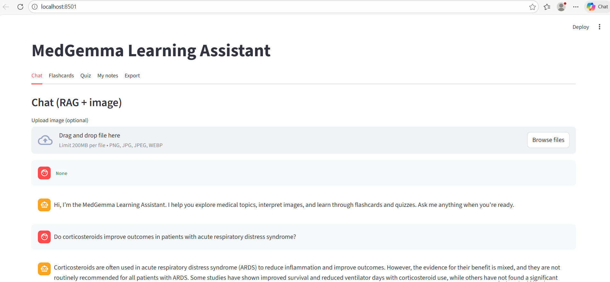

# MedGemma Learning Assistant (fully local)

A multimodal medical learning assistant with RAG, image understanding, flashcards, quizzes, and note‑taking.

MedGemma Learning Assistant is a fully local, privacy‑preserving study tool built around:

Retrieval‑Augmented Generation (RAG) using PubMedQA

MedGemma for medical text + image reasoning

Flashcard generation (from topics or your own Q&A)

Quiz generation with explanations

Persistent notes with export to Markdown

Streamlit web UI and CLI interface

This project is designed for medical learners who want a fast, local, and transparent assistant for studying clinical topics.

Features:

RAG‑powered medical Q&A:

-Retrieves relevant PubMedQA chunks using SentenceTransformers

-Generates concise, educational answers

-Shows source snippets for transparency

-Supports short conversation memory (last N turns)

Image understanding:

-Upload a medical image (X‑ray, CT, ultrasound, etc.)

-MedGemma interprets the image

-Optionally combines with RAG context

Flashcards:

-Generate flashcards from:

-A topic (e.g., “ARDS corticosteroids”)

Your last Q&A:

-Save to a local SQLite deck

-Review inside the Streamlit UI

Notes:

-Save any Q&A pair

-View all notes

-Export to Markdown

Quiz mode:

-Generate MCQs from a topic

-4‑option questions with correct answer

-Explanations after each question

Two interfaces:

-Streamlit web app (app.py)

-Command‑line interface (query_rag.py)

##Dataset:

- Default: [PubMed QA](https://huggingface.co/datasets/pubmed_qa) (`pubmed_qa`, subset `pqa_labeled`) — medical Q&A with abstract context and long answers.
- Change dataset: Edit `build_rag_index.py`: `DATASET_NAME`, `DATASET_SUBSET`, and optionally add a `docs_from_*` helper if the schema differs.

Installation:

1. Clone the repository
	
bash
	
		git clone https://github.com/MehrBSh/LLM-Projects/medgemma-learning-assistant.git
		
		cd medgemma-learning-assistant
		
2. Create a virtual environment
   
bash
		python3 -m venv .venv
		source .venv/bin/activate
		
3. Install dependencies
   
bash
		pip install -r requirements.txt
4. Download MedGemma
		The model will download automatically on first run via Hugging Face.

Build the RAG index:

This step downloads PubMedQA and builds a ChromaDB index.

bash
		python build_rag_index.py

This creates

Code
chroma_db/
    └── med_rag

Run the Streamlit app:

bash

		streamlit run app.py

You’ll get a UI with tabs: Chat, Flashcards, Quiz, My Notes, Export

  

Run the CLI:

bash

		python query_rag.py

Project Structure:
Code
.
├── app.py                # Streamlit UI
├── query_rag.py          # CLI interface
├── rag_engine.py         # RAG + MedGemma engine
├── build_rag_index.py    # Build ChromaDB index
├── flashcards.py         # Flashcard generation + parsing
├── quiz.py               # MCQ generation + parsing
├── store.py              # SQLite storage for notes + flashcards
├── export_notes.py       # Export notes to Markdown
├── chroma_db/            # Persistent vector store
└── learning_data.db      # SQLite database (auto-created)
 

How it works
1. Retrieval
Query is embedded with all-MiniLM-L6-v2

ChromaDB returns top‑k chunks

Chunks are injected into the prompt

2. Generation
MedGemma produces:

Text answers

Image interpretations

Flashcards

MCQs

Explanations

3. Storage
Notes and flashcards stored in SQLite

Export to Markdown supported

Privacy
Everything runs locally:

No cloud calls

No external logging

No data leaves your machine

# Sample questions for PubMed QA RAG (MedGemma)

--- Effectiveness / treatment ---
Do corticosteroids improve outcomes in patients with acute respiratory distress syndrome?
Is vitamin D supplementation effective for preventing fractures in older adults?
Does aspirin reduce the risk of cardiovascular events in diabetic patients?
Is cognitive behavioral therapy effective for treating insomnia?

--- Diagnosis / association ---
Is there an association between hypertension and cognitive decline?
Does elevated CRP predict worse outcomes in sepsis?
Are there biomarkers that can identify early-stage Alzheimer disease?

--- Drugs / interventions ---
Does metformin reduce cancer risk in type 2 diabetes?
Is statin therapy associated with reduced mortality in heart failure?
Do beta-blockers improve survival after myocardial infarction?

--- Conditions / mechanisms ---
What is the role of inflammation in the development of atherosclerosis?
Does sleep deprivation affect immune function?
Is obesity a risk factor for postoperative complications?

--- Short / direct ---
Does smoking increase the risk of lung cancer?
Is exercise beneficial for depression?
Can probiotics prevent antibiotic-associated diarrhea?
